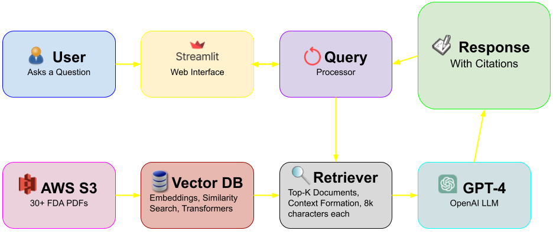

# Medical Device Regulation Navigator

An AI-powered system that helps navigate FDA medical device regulations using Retrieval-Augmented Generation (RAG). Get expert answers about device classification, 510(k) submissions, compliance requirements, and more - all sourced from official regulatory documents.

[Watch the demo on YouTube](https://www.youtube.com/watch?v=rW85OK4VSag)

## Features

- Smart Document Search: Finds relevant information from 30+ FDA guidance documents and regulations
- AI-Powered Answers: Generates accurate responses based on official regulatory sources
- Interactive Interface: Clean web interface for asking regulatory questions
- Cost-Optimized: Designed to minimize API costs while maintaining quality
- Citation Support: All answers include references to source documents
- Domain-Specific: Understands medical device terminology and regulatory pathways

## Table of Contents

## Problem Statement

Medical device professionals face significant challenges when navigating FDA regulations:
- Information Overload: 1000+ pages of guidance documents, regulations, and technical standards scattered across multiple FDA websites
- Complex Regulatory Language: Dense technical jargon that's difficult to parse and interpret quickly
- Time-Sensitive Decisions: Engineers and regulatory professionals need accurate answers fast to meet development timelines
- High Consultation Costs: Regulatory consultants charge $300-500/hour for guidance that could be found in public documents
- Inconsistent Interpretations: Different teams within organizations may interpret the same regulation differently

## Solution

This RAG-powered system solves these problems by:
- Instant Access: Search through 30+ FDA guidance documents and regulations in seconds, not hours
- Clear Answers: Converts complex regulatory language into clear, actionable guidance
- Source Citations: Every answer includes references to specific FDA documents and sections
- Always Current: Can be updated with new guidance documents as they're published
- Cost-Effective: Reduces dependency on expensive regulatory consultations for routine questions
- Standardized Interpretations: Ensures consistent understanding across teams and organizations

## Impact

For Medical Device Companies:
- Reduce Time-to-Market: Faster regulatory guidance means quicker design decisions
- Lower Compliance Costs: Reduce regulatory consulting fees by 60-80% for routine inquiries
- Improve Team Efficiency: Engineers get instant answers instead of waiting for regulatory reviews

For Regulatory Professionals:
- Focus on Complex Issues: Spend time on strategy rather than answering routine questions
- Training Tool: Help junior staff learn regulations faster with interactive Q&A

For the Industry:
- Democratize Regulatory Knowledge: Make FDA guidance accessible to smaller companies
- Standardize Interpretations: Reduce industry-wide inconsistencies in regulatory understanding
- Accelerate Innovation: Faster regulatory clarity enables more rapid medical device development

## Tech Stack
| ***Layer***| ***Technologies*** |     ***Purpose*** |
| :---:         |     :---:      |          :---: |
| User Interface  | Streamlit, Custom CSS and HTML, Altair Charts   | Interactive web interface with chat, visualizations, and cost tracking|
| AI Generation   | OpenAI GPT-4     | Generate accurate, contextual answers with regulatory expertise     |
| Document Retrieval | HuggingFace Transformers, Vector Similarity Search, Hybrid Retrieval     | Find relevant documents using semantic + keyword search    |
| Text Processing    | NLTK, Query Processor, Medical Terminology       | Clean text, enhance queries, handle medical device terms     |
| Document Processing   | pdfplumber, Text Chunking, Metadata Extraction   | Extract and structure content from FDA PDF documents    |
| Data Storage    | AWS S3, Local Cache      | Store PDFs, vectors, and cached responses efficiently   |
| Infrastructure  | Python 3.8, OpenAI API Key, AWS Account, Virtual Environment   | Runtime environment, dependency management, security   |

| ***Performance*** | 30+ Documents, <3s Response,  60% Cache Hit, $0.01-0.15 per Query|
| ------------- | ------------- |

## System Flow

## Document Collection
| ***Current Categories***| ***Examples*** |
| :---         |     :---:      | 
| Classification  | Device classification procedures, Product categorization  |
| Compliance  | QSR (21 CFR 820), Medical device reporting, UDI   | 
| Software| AI/ML guidance, Software validation, Cybersecurity |
| Submission   | 510(k), PMA, IDE guidance     | 
| Testing   | ISO 10993, ISO 14971, Consensus standards  | 

